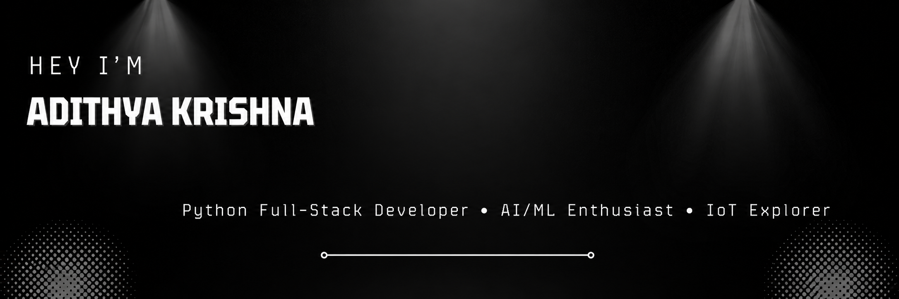

<!-- ===================== BANNER ===================== -->

  

 

<!-- ===================== PORTFOLIO ===================== -->

  

 

<!-- ===================== SOCIAL LINKS ===================== -->

<h2 align="center">🌐 Connect With Me</h2>

  

  

  

  

 

<!-- ===================== ABOUT ME ===================== -->

<h2>👨‍💻 About Me</h2>

<pre><code>class AdithyaKrishna:
    name       = "Adithya Krishna"
    location   = "India 🇮🇳"
    role       = "Python Full-Stack Developer"
    focus      = ["Full-Stack Development", "AI/ML", "IoT"]
    learning   = ["Advanced Python", "FastAPI", "React", "Machine Learning"]
    side_quest = "Building projects and improving every day 🚀"
    fun_fact   = "I build things that connect code, applications, AI, and the real world 🤖"
</code></pre>

 

<!-- ===================== TECH STACK ===================== -->

<h2>🛠️ Tech Stack</h2>

  

 

<!-- ===================== TOOLS & DEVOPS ===================== -->

<h2>⚙️ Tools & DevOps</h2>

  

 

<!-- ===================== PROJECTS ===================== -->

<h2>🚀 Projects</h2>

<table>
<tr>

<td width="50%">

<h3>🩸 Menstrual Cycle Calculator</h3>

A responsive frontend web application that calculates menstrual cycle information using HTML, CSS and JavaScript.

  

</td>

<td width="50%">

<h3>🧮 Python Calculator</h3>

A calculator built while learning Python fundamentals and improving programming logic.

  

</td>

</tr>

<tr>

<td width="50%">

<h3>🛒 Shopping Billing Counter</h3>

A Python-based billing system implementing calculations and user interaction.

  

</td>

<td width="50%">

<h3>⚖️ Weight Converter</h3>

A simple Python conversion tool created to practice logic building.

  

</td>

</tr>

<tr>

<td width="50%">

<h3>🗳️ Election Age Verifier</h3>

A Python program checking voting eligibility using conditions.

</td>

<td width="50%">

<h3>🔐 Username Login Browser</h3>

A project exploring username validation and login concepts.

</td>

</tr>

</table>

<!-- ===================== GITHUB STATS ===================== -->

<h2>📊 GitHub Stats</h2>

  

 

  

 

  

 

<!-- ===================== FOOTER ===================== -->

  🚀 Always learning. Always building. Always improving.

